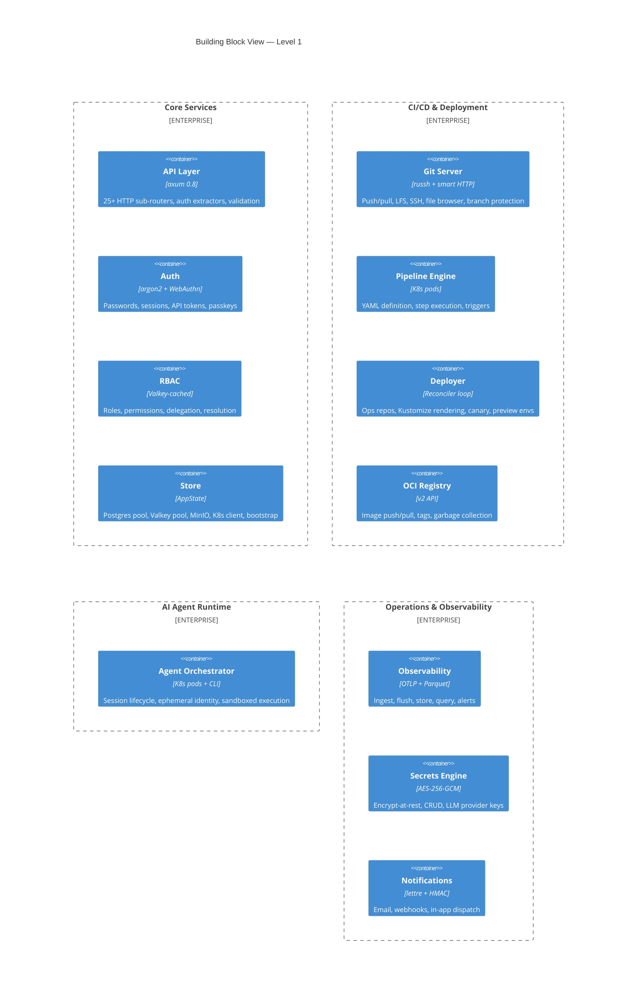
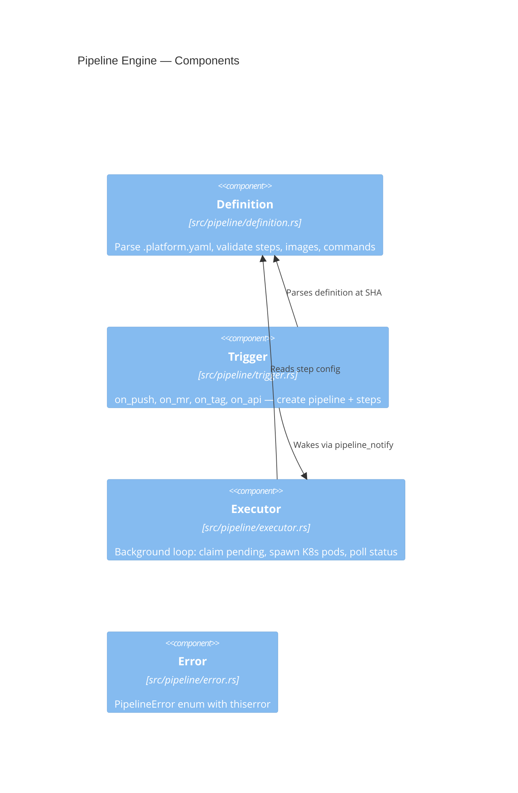
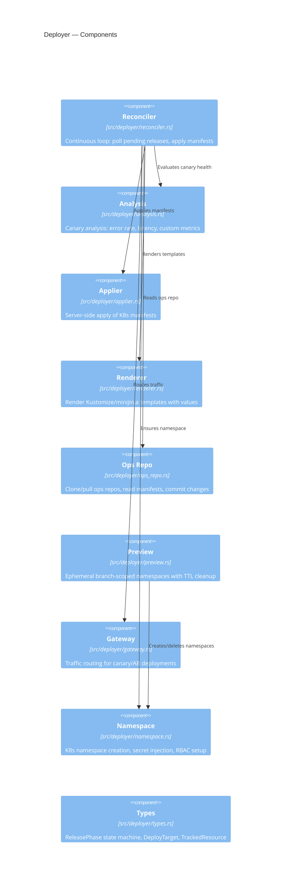
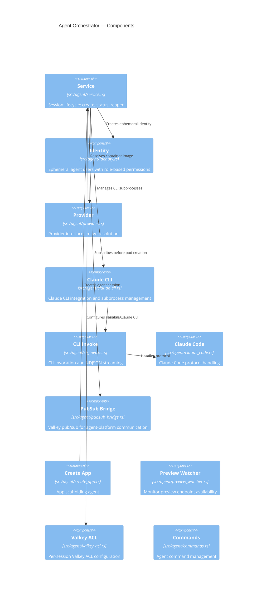
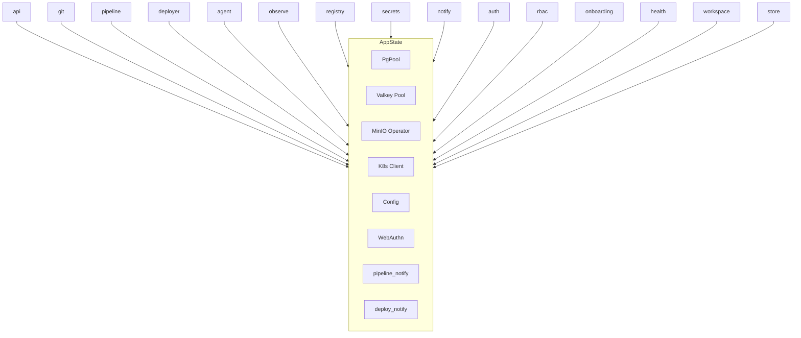

# 5. Building Block View

## Level 1 — Platform Modules

The platform is a single Rust binary (~68K LOC, plus ~38K LOC tests) composed of 15 modules that communicate through shared `AppState`. The database schema spans 64 migration pairs.

<!-- mermaid:diagrams/containers.mmd -->

<!-- /mermaid -->

## Level 2 — Module Decomposition

### API Layer (`src/api/`)

The API module is the largest (~17K LOC, 30 files) with 25+ sub-routers merged into a single `Router<AppState>`:

| Sub-router | Purpose | Key Endpoints |
|---|---|---|
| `users` | Authentication | Login, logout, session management |
| `admin` | Administration | User CRUD, role assignment, delegation management |
| `projects` | Project management | CRUD, visibility, settings, namespace config |
| `issues` | Issue tracking | Create, list, update, comment |
| `merge_requests` | Code review | MR lifecycle, reviews, merge, auto-merge |
| `webhooks` | External integrations | CRUD, HMAC-signed delivery |
| `pipelines` | Build engine | Trigger, list, status, step logs |
| `deployments` | Deploy tracking | Status, promote, rollback, release history |
| `flags` | Feature flags | CRUD, rules, overrides, evaluation |
| `sessions` | Agent sessions | Create, list, messages, status |
| `secrets` | Secret management | CRUD, scoped injection |
| `notifications` | Notification queries | List, mark read |
| `passkeys` | WebAuthn | Registration, authentication |
| `user_keys` / `ssh_keys` / `gpg_keys` | Key management | SSH/GPG public keys |
| `workspaces` | Workspace management | CRUD, membership |
| `branch_protection` | Git policy | Protection rules |
| `releases` | Release management | Create, list, assets |
| `dashboard` | UI data | Aggregated dashboard views |
| `onboarding` | New user flow | Demo project creation |
| `setup` | Initial setup | First-admin via setup token |
| `cli_auth` | CLI auth | Claude CLI device-code flow |
| `commands` | Global commands | CRUD for platform commands |
| `downloads` | Agent binaries | Binary distribution |
| `health` | System health | Subsystem status |
| `llm_providers` | LLM config | Provider CRUD, validation |

Also merged: `git::browser_router()` for repository browsing (history, blame, tree, blob).

### Git Module (`src/git/`)

| Sub-module | Purpose |
|---|---|
| `smart_http` | Git Smart HTTP protocol (info/refs, upload-pack, receive-pack) |
| `ssh_server` | Git over SSH (russh) |
| `lfs` | Git LFS batch API + object storage via MinIO |
| `browser` | Repository browser (tree, blob, commits, branches, blame) |
| `hooks` | Post-receive hooks (trigger pipelines, update MR head_sha) |
| `repo` | Repository creation, bare repo management |
| `protection` | Branch protection rule enforcement |
| `signature` | GPG commit signature verification |
| `ssh_keys` / `gpg_keys` | User key management |
| `templates` | Template files for new repositories |

### Pipeline Engine (`src/pipeline/`)

<!-- mermaid:diagrams/components-pipeline.mmd -->

<!-- /mermaid -->

**Step types:**

| Step Type | Executor Behavior | Spawns Pod? |
|---|---|---|
| `command` | Run arbitrary container with setup commands | Yes |
| `imagebuild` | Generate kaniko command, inject secrets as `--build-arg`, push to registry | Yes (kaniko) |
| `deploy_test` | Create test namespace, apply testinfra manifests, spawn test pod, cleanup | Yes (test runner) |
| `gitops_sync` | Copy files to ops repo, merge variables, commit, publish OpsRepoUpdated event | No (in-process) |
| `deploy_watch` | Poll deploy_releases table until terminal phase | No (in-process) |

### Deployer (`src/deployer/`)

<!-- mermaid:diagrams/components-deployer.mmd -->

<!-- /mermaid -->

### Agent Orchestrator (`src/agent/`)

<!-- mermaid:diagrams/components-agent.mmd -->

<!-- /mermaid -->

The most complex module (~12K LOC, 23 files, 14 sub-modules):

| Sub-module | Purpose |
|---|---|
| `service` | Session lifecycle: create, status, reaper |
| `identity` | Ephemeral agent users with role-based permissions |
| `provider` | Provider interface, image resolution (explicit > registry > default) |
| `claude_code` | Claude Code protocol handling |
| `claude_cli` | Claude CLI integration and subprocess management |
| `cli_invoke` | CLI invocation and NDJSON streaming |
| `pubsub_bridge` | Valkey pub/sub for agent ↔ platform communication |
| `create_app` | App scaffolding agent |
| `create_app_prompt` | LLM prompt templates for app creation |
| `commands` | Agent command management |
| `preview_watcher` | Monitor preview endpoint availability |
| `valkey_acl` | Per-session Valkey ACL configuration |
| `llm_validate` | LLM provider validation |
| `error` | AgentError enum |

**Agent role system:**

| Role | Scope | Permissions |
|---|---|---|
| `Dev` | Project | Code changes, branch management |
| `Ops` | Project | Deployment operations |
| `Test` | Project | Test execution |
| `Review` | Project | Code review |
| `Manager` | Workspace | Cross-project coordination |

### Observability (`src/observe/`)

| Sub-module | Purpose |
|---|---|
| `ingest` | OTLP HTTP endpoints (traces, logs, metrics) — protobuf parsing |
| `proto` | OTLP Protobuf type definitions (prost) |
| `parquet` | Time-based Parquet rotation to MinIO (cold storage) |
| `store` | Columnar query engine for Parquet files |
| `query` | Trace/log/metric query API with time-range filtering |
| `alert` | Alert rule evaluation loop, threshold checking, notification dispatch |
| `correlation` | Trace correlation (trace_id, session_id, project_id, user_id) |
| `tracing_layer` | Platform self-observability bridge |
| `error` | ObserveError enum |

**Background tasks** (5 spawned by `spawn_background_tasks()`):
1. Traces flush — channel drain → Postgres batch insert
2. Logs flush — channel drain → Postgres + Valkey pub/sub for live tail
3. Metrics flush — channel drain → Postgres upsert
4. Parquet rotation — time-based file rotation to MinIO
5. Alert evaluation — periodic rule evaluation against stored data

### Auth & RBAC (`src/auth/` + `src/rbac/`)

| Sub-module | Purpose |
|---|---|
| `auth/password` | Argon2 hashing, timing-safe verify, dummy hash for missing users |
| `auth/middleware` | `AuthUser` extractor (Bearer token → session cookie fallback) |
| `auth/token` | API token creation, validation, expiry |
| `auth/passkey` | WebAuthn registration and authentication |
| `auth/rate_limit` | Valkey-backed rate limiting (sliding window) |
| `auth/user_type` | `UserType` enum: human, agent, service_account |
| `auth/cli_creds` | CLI credential storage |
| `rbac/types` | `Permission` enum (all RBAC permissions) |
| `rbac/resolver` | Permission resolution with Valkey cache (5min TTL) |
| `rbac/delegation` | Time-bounded permission delegation |

### Store (`src/store/`)

Central infrastructure wiring:

| Sub-module | Purpose |
|---|---|
| `bootstrap` | DB initialization: system roles, permissions, first admin |
| `eventbus` | Event dispatch system for cross-module communication |
| `pool` | Postgres connection pool setup |
| `valkey` | Valkey connection pool setup |
| `commands_seed` | Seed built-in platform commands from .md files |

### OCI Registry (`src/registry/`)

Built-in container image registry (~3.4K LOC, 11 files) implementing the OCI Distribution Spec v2:

| Sub-module | Purpose |
|---|---|
| `v2` | OCI v2 API: manifests, blobs, tags, catalog |
| `gc` | Garbage collection of unreferenced layers |
| `proxy` | DaemonSet-based pull-through proxy for Kind clusters |

### Remaining Modules

| Module | LOC | Sub-modules | Purpose |
|---|---|---|---|
| `onboarding/` | ~2K | `demo_project`, `claude_auth`, `templates/` | Demo project scaffolding, Claude CLI auth flow |
| `secrets/` | ~1.7K | `engine`, `request`, `user_keys`, `llm_providers` | AES-256-GCM encryption, ephemeral secret requests, LLM provider keys |
| `health/` | ~800 | `checks` | Subsystem health checks (DB, Valkey, MinIO, K8s) |
| `notify/` | ~500 | `dispatch`, `email`, `webhook` | Route events to email (lettre SMTP) or webhooks (HMAC-SHA256) |
| `workspace/` | ~400 | `mod` | Workspace CRUD, membership, implicit project permissions |

## Module Communication

Modules communicate exclusively through `AppState` — there are no direct imports between module internals:

<!-- mermaid:diagrams/module-communication.mmd -->

<!-- /mermaid -->
