# 6. Runtime View

8 scenarios covering the platform's major flows. For the CI/CD scenarios (R1-R4), see also [`plans/cicd-process-spec-v2.md`](../../plans/cicd-process-spec-v2.md).

## R1: Full CI/CD Lifecycle (Overview)

The end-to-end flow from code push through production deployment:

<!-- mermaid:diagrams/runtime-cicd-overview.mmd -->
```mermaid
flowchart LR
    subgraph CodeRepo["Code Repo"]
        push[git push]
        mr[MR Created]
        yaml[.platform.yaml]
    end

    subgraph MRPipeline["MR Pipeline"]
        build_mr[imagebuild x4]
        test[deploy_test]
    end

    subgraph MergeGate["Merge Gate"]
        auto[auto_merge check]
        merge["--no-ff merge"]
    end

    subgraph MainPipeline["Main Pipeline"]
        build_main[imagebuild x3]
        sync[gitops_sync]
        watch[deploy_watch]
    end

    subgraph OpsRepo["Ops Repo"]
        copy[Copy deploy/]
        values[Merge variables]
        commit[Commit to staging]
    end

    subgraph Staging["Staging Deploy"]
        recon_s[Reconciler]
        ns_s[Create namespace]
        apply_s[Apply manifests]
        canary_s[Canary analysis]
        promote_s[Promote 100%]
    end

    subgraph Production["Production Deploy"]
        manual[Manual promote]
        recon_p[Reconciler]
        canary_p[Canary analysis]
        promote_p[Promote 100%]
    end

    push --> mr --> yaml --> build_mr --> test --> auto
    auto --> merge --> build_main --> sync --> watch
    sync --> copy --> values --> commit
    commit --> recon_s --> ns_s --> apply_s --> canary_s --> promote_s
    promote_s --> manual --> recon_p --> canary_p --> promote_p
```
<!-- /mermaid -->

---

## R2: MR Pipeline — Trigger, Build, Test

Covers the flow from feature branch push through pipeline execution.

<!-- mermaid:diagrams/runtime-mr-pipeline.mmd -->
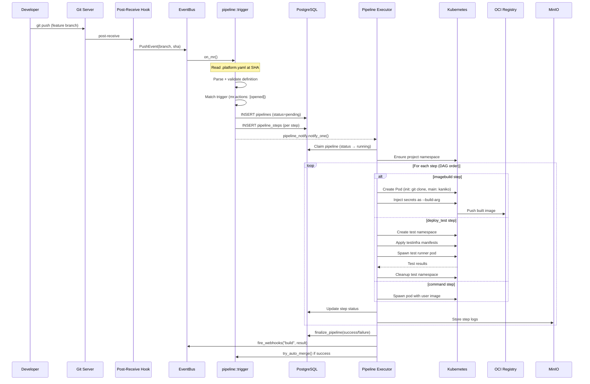
<!-- /mermaid -->

---

## R3: Auto-Merge, Main Pipeline, GitOps Sync

After a successful MR pipeline, the auto-merge and main branch pipeline flow:

<!-- mermaid:diagrams/runtime-merge-gitops.mmd -->
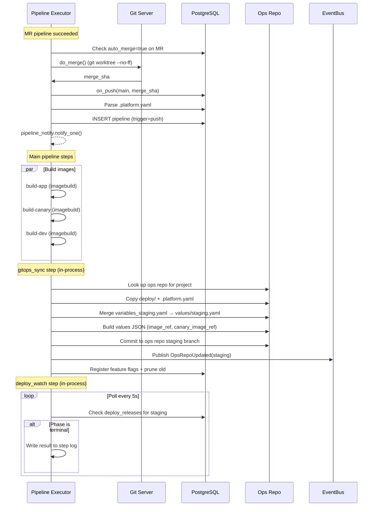
<!-- /mermaid -->

---

## R4: Deploy Pipeline — Reconciler + Canary Progression

The deployment reconciliation flow triggered by ops repo updates:

<!-- mermaid:diagrams/runtime-deploy-canary.mmd -->
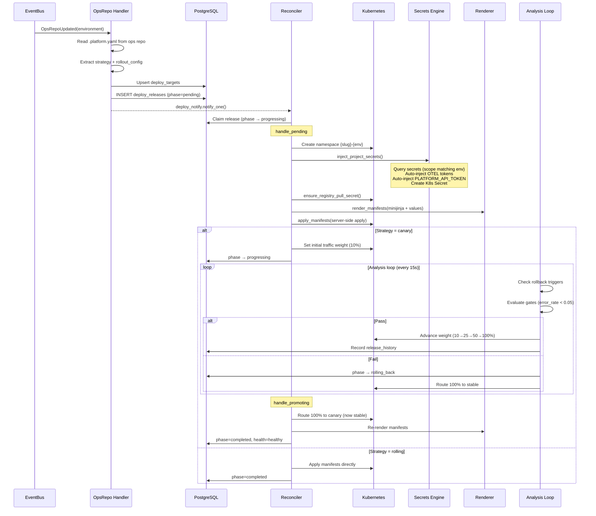
<!-- /mermaid -->

### Manual Promotion (Staging → Production)

```
API → POST /promote-staging
API → Merge ops repo staging branch → main branch
API → Publish OpsRepoUpdated(production)
→ Same reconciler flow for production environment
```

---

## R5: Authentication Flow

Login → session → AuthUser extractor → RBAC permission check:

<!-- mermaid:diagrams/runtime-auth.mmd -->
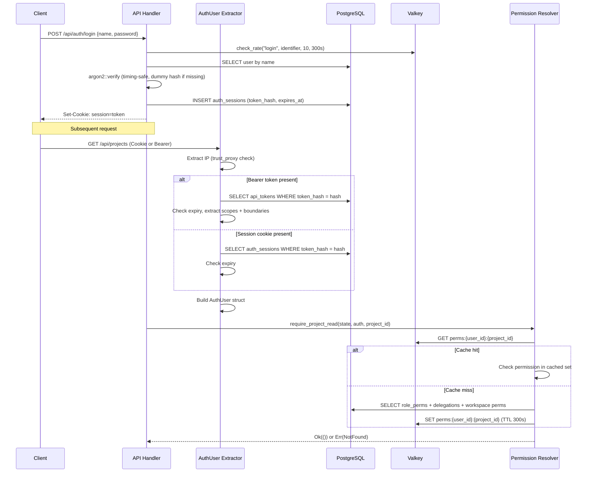
<!-- /mermaid -->

---

## R6: Agent Session Lifecycle

Create session → spawn K8s pod → ephemeral identity → NDJSON streaming → reaper:

<!-- mermaid:diagrams/runtime-agent.mmd -->
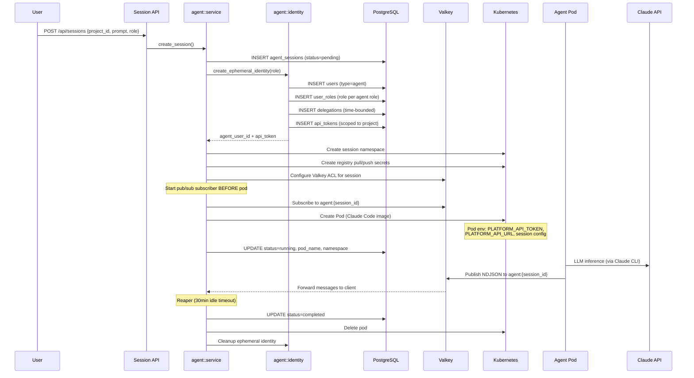
<!-- /mermaid -->

---

## R7: Observability Pipeline

OTLP ingest → channel buffer → Postgres (hot) → Parquet/MinIO (cold) → query → alerts:

<!-- mermaid:diagrams/runtime-observe.mmd -->
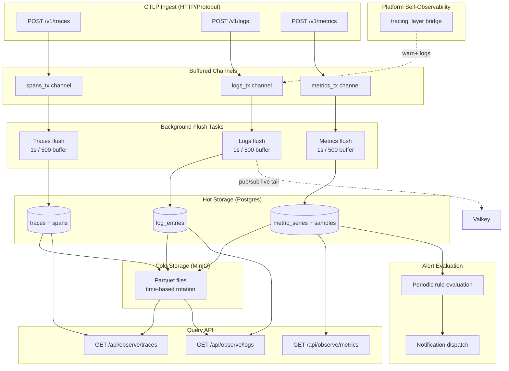
<!-- /mermaid -->

---

## R8: State Machines

### Pipeline Status

<!-- mermaid:diagrams/state-pipeline.mmd -->
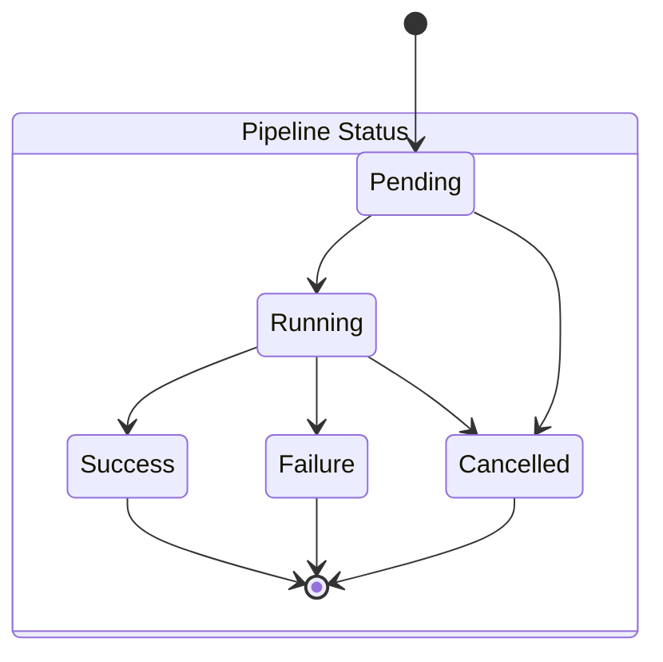
<!-- /mermaid -->

### Pipeline Step Status

<!-- mermaid:diagrams/state-step.mmd -->
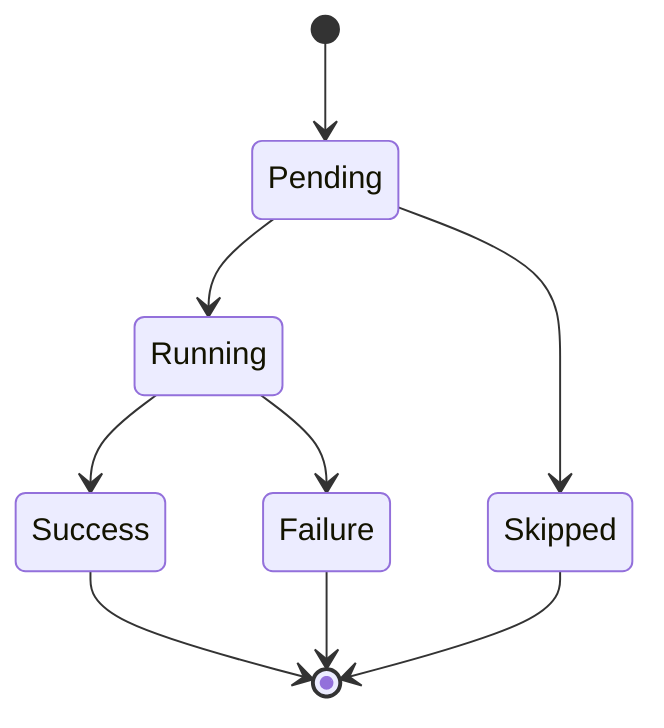
<!-- /mermaid -->

### Release Phase (Deployment)

The most complex state machine — supports canary, rolling, and AB test strategies:

<!-- mermaid:diagrams/state-deployment.mmd -->
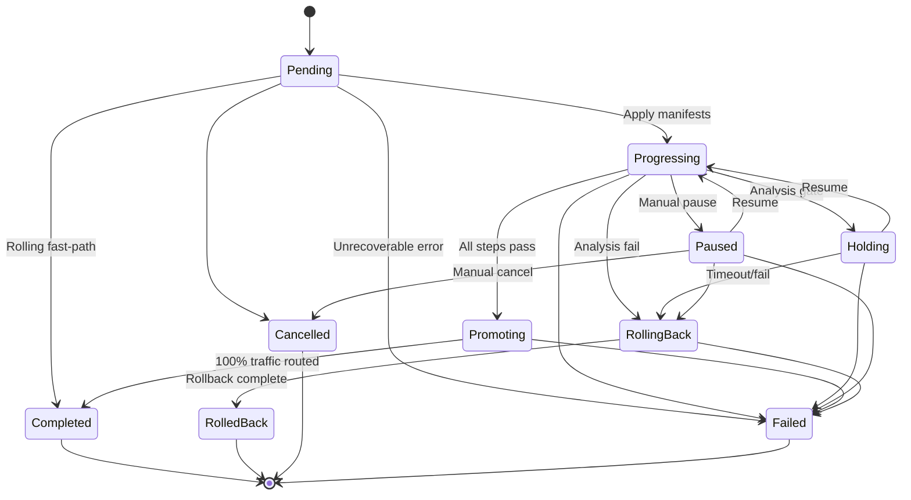
<!-- /mermaid -->

### Agent Session Status

<!-- mermaid:diagrams/state-agent-session.mmd -->
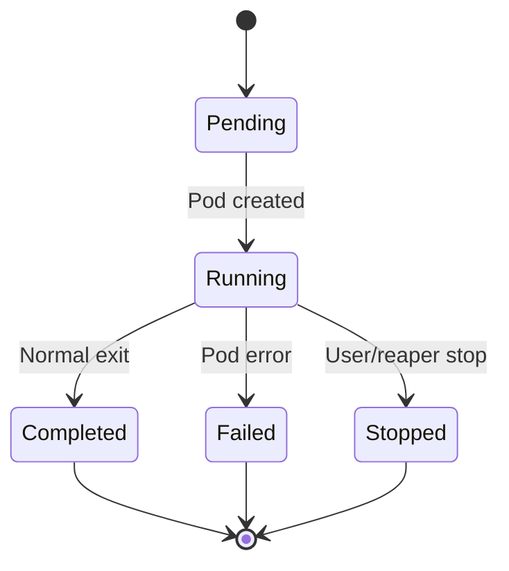
<!-- /mermaid -->

---

## Additional Reference Diagrams

### Two-Repo Topology

How the code repo and ops repo relate during GitOps sync:

<!-- mermaid:diagrams/two-repo-topology.mmd -->
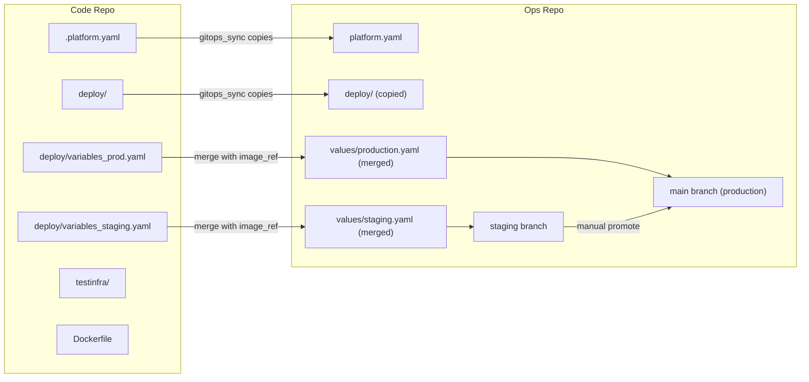
<!-- /mermaid -->

### Pipeline Step Types

Overview of all step types and their execution model:

<!-- mermaid:diagrams/step-types.mmd -->
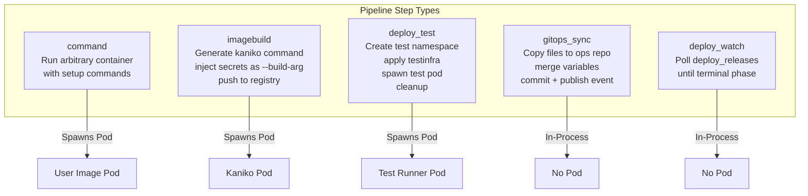
<!-- /mermaid -->
