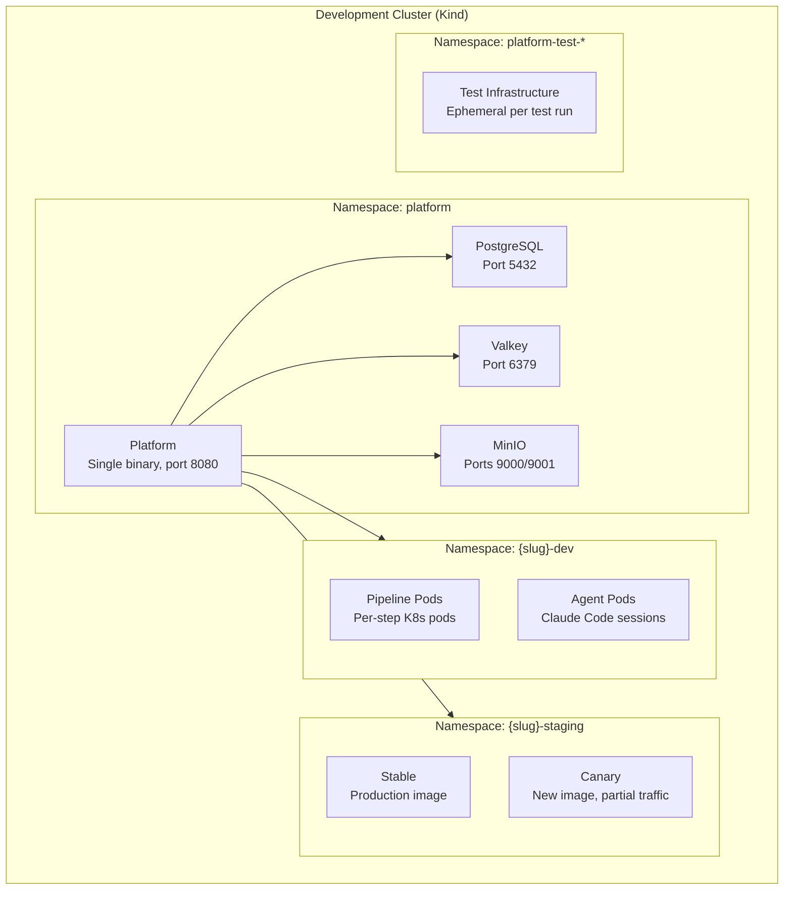
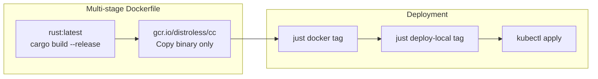
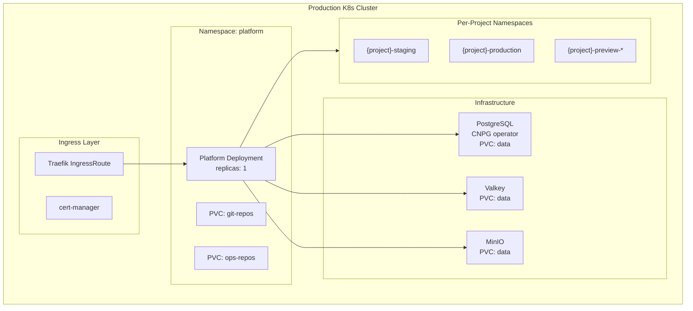

# 7. Deployment View

## Kind Development Cluster

The development environment uses a single-node Kind cluster with port-mapped services:

<!-- mermaid:diagrams/deployment-kind.mmd -->

<!-- /mermaid -->

### Port Mappings

| Host Port | Service | Protocol |
|---|---|---|
| 5432 | PostgreSQL | TCP |
| 6379 | Valkey | RESP |
| 8080 | Platform (HTTP + Git + Registry) | HTTP |
| 9000 | MinIO (S3 API) | HTTP |
| 9001 | MinIO (Console) | HTTP |
| 2222 | Platform (Git SSH) | SSH |

### Setup

```bash
just cluster-up     # Creates Kind cluster + deploys Postgres, Valkey, MinIO
just cluster-down   # Destroys cluster
```

## Namespace Strategy

The platform uses per-project K8s namespaces for tenant isolation:

| Namespace Pattern | Purpose | Created By |
|---|---|---|
| `platform` | Platform itself (configurable via `PLATFORM_NAMESPACE`) | Operator |
| `{slug}-dev` | Pipeline pods, agent pods | Pipeline executor, agent service |
| `{slug}-staging` | Staging deployments | Deployer reconciler |
| `{slug}-production` | Production deployments | Deployer reconciler |
| `{slug}-preview-{branch}` | Preview environments | Preview manager |
| `platform-test-{run_id}` | Ephemeral test infrastructure | Test harness |

Each namespace gets:
- Registry pull secret (if `PLATFORM_REGISTRY_URL` configured)
- Project secrets (scoped by environment)
- OTEL tokens (auto-injected for observability)
- `PLATFORM_API_TOKEN` (auto-injected for platform API access)

## Container Image

<!-- mermaid:diagrams/container-image.mmd -->

<!-- /mermaid -->

The final image contains only:
- The compiled Rust binary
- The embedded Preact SPA (via rust-embed)
- CA certificates for TLS

## Production Target (Aspirational)

<!-- mermaid:diagrams/deployment-prod.mmd -->

<!-- /mermaid -->

### Production Requirements (Not Yet Implemented)

- Multi-replica support (requires leader election for background tasks)
- Persistent volumes for git repos and ops repos
- Backup strategy for PostgreSQL
- MinIO cluster mode or external S3
- TLS termination at ingress
- Network policies between tenant namespaces
