# 8. Crosscutting Concepts

## Authentication

### Login Flow

1. **Password auth**: Argon2 hash verify with timing-safe comparison (dummy hash for missing users to prevent enumeration)
2. **Session creation**: `auth_sessions` table with `token_hash` (SHA-256 of session token)
3. **Token auth**: Bearer token → `api_tokens` table lookup by `token_hash`
4. **Passkeys**: WebAuthn via `webauthn_rs` — registration and authentication

### AuthUser Extractor

Every API handler uses `AuthUser` as an axum extractor. Resolution order:

1. `Authorization: Bearer <token>` → `api_tokens` table
2. Session cookie → `auth_sessions` table
3. Neither → 401 Unauthorized

Extracted fields: `user_id`, `user_name`, `user_type`, `ip_addr`, `token_scopes`, `boundary_workspace_id`, `boundary_project_id`, `session_id`.

### Two-Layer Enforcement

| Layer | What It Does | Where |
|---|---|---|
| **Layer 1: AuthUser** | Authenticates identity, extracts scope boundaries | Middleware (extractor) |
| **Layer 2: Permission helpers** | Checks RBAC + scope boundaries | Handler (explicit call) |

A handler with only `AuthUser` has identity but **no authorization**. Always call `require_project_read()`, `require_project_write()`, or `require_admin()`.

## Authorization (RBAC)

### Permission Resolution

```
effective_permissions = global_role_perms
                      ∪ project_role_perms
                      ∪ active_delegations
                      ∪ workspace_derived_perms
```

Cached in Valkey as `perms:{user_id}:{project_id}` with configurable TTL (default 300s).

### Role Hierarchy

| Role | Scope | Key Permissions |
|---|---|---|
| `admin` | System | All permissions |
| `developer` | System/Project | Code push, MR create, pipeline trigger |
| `ops` | System/Project | Deployment management, secret access |
| `agent` | Project (via delegation) | No default permissions — granted via delegation |
| `viewer` | System/Project | Read-only access |

### Delegation Model

Humans can delegate scoped, time-bounded permissions to agents:

```sql
INSERT INTO delegations (delegator_id, delegate_id, permission_id, project_id, expires_at)
```

### Workspace-Derived Permissions

Workspace membership grants implicit project permissions:
- **Owner/Admin** → `ProjectRead` + `ProjectWrite` on all workspace projects
- **Member** → `ProjectRead` on all workspace projects

## Input Validation

All user input validated at handler boundary using `src/validation.rs`:

| Field Type | Min | Max | Validator |
|---|---|---|---|
| Name/slug | 1 | 255 | `check_name()` |
| Email | 3 | 254 | `check_email()` |
| Password | 8 | 1,024 | `check_length()` |
| Title | 1 | 500 | `check_length()` |
| Body/description | 0 | 100,000 | `check_length()` |
| URL | 1 | 2,048 | `check_url()` |
| Labels | — | 50 items, each 1-100 | `check_labels()` |
| Branch name | 1 | 255 | `check_branch_name()` |
| Container image | — | — | `check_container_image()` |

## Security

### Defense in Depth

| Layer | Mechanism |
|---|---|
| **Network** | Body size limits (10MB API, 500MB Git/Registry), CORS deny-by-default |
| **Auth** | Rate limiting (Valkey-backed), timing-safe comparison, secure cookies |
| **SSRF** | Block private IPs, link-local, loopback, cloud metadata on outbound URLs |
| **Injection** | Container image validation, branch name validation, parameterized SQL |
| **Headers** | `X-Frame-Options: DENY`, `X-Content-Type-Options: nosniff`, `Referrer-Policy: strict-origin-when-cross-origin` |
| **Secrets** | AES-256-GCM encryption at rest, never logged, PLATFORM_MASTER_KEY required in prod |
| **Audit** | All mutations → `audit_log` table with actor, action, resource, IP |
| **Webhooks** | HMAC-SHA256 signing, 5s connect / 10s total timeout, 50 concurrent limit, no URL logging |

### Sensitive Data Policy

**Never log**: passwords, tokens, secret values, API keys, webhook URLs (may contain tokens).

## Error Handling

### Error Type Hierarchy

```
Module-specific error (thiserror)
    → ApiError (HTTP status mapping)
        → JSON response to client
```

Each module defines its own error enum. `From<ModuleError> for ApiError` maps to HTTP status codes:

| ApiError Variant | HTTP Status | When |
|---|---|---|
| `NotFound` | 404 | Resource not found OR unauthorized access to private resource |
| `Unauthorized` | 401 | Missing or invalid credentials |
| `Forbidden` | 403 | Valid credentials but insufficient permissions (admin-only) |
| `BadRequest` | 400 | Validation failure |
| `Conflict` | 409 | Duplicate resource (unique constraint violation) |
| `TooManyRequests` | 429 | Rate limit exceeded |
| `Internal` | 500 | Unexpected errors |

Key pattern: return **404** (not 403) for unauthorized access to private resources to avoid leaking existence.

## Observability

### Structured Logging

All async functions with side effects instrumented with `#[tracing::instrument]`:

```rust
#[tracing::instrument(skip(pool, state), fields(user_id = %user_id), err)]
```

Rules:
- `skip(pool, state, config)` — always skip large/non-Debug fields
- `fields(key = %value)` — include IDs and context
- Structured fields only: `tracing::info!(count = 5, "processed")` not string interpolation
- Error chains: `tracing::error!(error = %err, "operation failed")`

### Correlation Context

Every span/log carries: `trace_id`, `session_id`, `project_id`, `user_id`.

### Self-Observability

Platform's own warn+ logs are fed into the observe pipeline via `tracing_layer::spawn_bridge()`.

## State Machines

All status fields are Rust enums with `can_transition_to()` methods. Invalid transitions are caught at compile time for enum variants and at runtime for transition validation.

Key state machines:
- **PipelineStatus**: Pending → Running → {Success, Failure, Cancelled}
- **PipelineStepStatus**: Pending → Running → {Success, Failure, Skipped}
- **ReleasePhase**: 10 states with complex transition graph (see [Section 6, R8](06-runtime-view.md#r8-state-machines))
- **AgentSessionStatus**: Pending → Running → {Completed, Failed, Stopped}

## Testing Strategy

4-tier pyramid:

| Tier | Count | Runtime | Infra | Mock LLM |
|---|---|---|---|---|
| Unit | ~1600 | ~1s | None | N/A |
| Integration | 52 files | ~2.5min | Postgres, Valkey, MinIO, K8s | Mock CLI |
| E2E | 9 files | ~2.5min | All real + background tasks | Disabled |
| LLM | — | Variable | Real Claude CLI | Real API |

Key patterns:
- `#[sqlx::test]` for per-test DB isolation
- `test_state(pool)` builds full `AppState` with real infra
- Mock CLI via `CLAUDE_CLI_PATH=cli/claude-mock/claude`
- No FLUSHDB — all Valkey keys are UUID-scoped
- 100% diff coverage enforcement on changed lines

## Domain Model

```mermaid
erDiagram
    %% Identity & Auth
    users {
        uuid id PK
        text name UK
        text email UK
        text password_hash
        text user_type "human|agent|service_account"
        boolean is_active
    }
    workspaces {
        uuid id PK
        text name UK
        uuid owner_id FK
        boolean is_active
    }
    workspace_members {
        uuid id PK
        uuid workspace_id FK
        uuid user_id FK
        text role "owner|admin|member"
    }
    roles {
        uuid id PK
        text name UK
        boolean is_system
    }
    permissions {
        uuid id PK
        text name UK
        text resource
        text action
    }
    role_permissions {
        uuid role_id FK
        uuid permission_id FK
    }
    user_roles {
        uuid id PK
        uuid user_id FK
        uuid role_id FK
        uuid project_id FK
    }
    delegations {
        uuid id PK
        uuid delegator_id FK
        uuid delegate_id FK
        uuid permission_id FK
        uuid project_id FK
        timestamptz expires_at
    }
    auth_sessions {
        uuid id PK
        uuid user_id FK
        text token_hash UK
        timestamptz expires_at
    }
    api_tokens {
        uuid id PK
        uuid user_id FK
        text token_hash UK
        text[] scopes
        uuid project_id FK
    }
    passkey_credentials {
        uuid id PK
        uuid user_id FK
        bytea credential_id UK
    }

    %% Projects & PM
    projects {
        uuid id PK
        uuid owner_id FK
        uuid workspace_id FK
        text name
        text namespace_slug UK
        text visibility "private|internal|public"
        boolean is_active
    }
    issues {
        uuid id PK
        uuid project_id FK
        integer number
        uuid author_id FK
        text title
        text status "open|closed"
    }
    merge_requests {
        uuid id PK
        uuid project_id FK
        integer number
        uuid author_id FK
        text source_branch
        text target_branch
        text status "open|merged|closed"
        boolean auto_merge
    }
    mr_reviews {
        uuid id PK
        uuid mr_id FK
        uuid reviewer_id FK
        text verdict "approve|request_changes|comment"
    }
    comments {
        uuid id PK
        uuid project_id FK
        uuid issue_id FK
        uuid mr_id FK
        uuid author_id FK
        text body
    }
    webhooks {
        uuid id PK
        uuid project_id FK
        text url
        text[] events
    }

    %% Pipeline
    pipelines {
        uuid id PK
        uuid project_id FK
        text trigger "push|api|schedule|mr|tag"
        text status "pending|running|success|failure|cancelled"
    }
    pipeline_steps {
        uuid id PK
        uuid pipeline_id FK
        text name
        text step_type "command|imagebuild|deploy_test|gitops_sync|deploy_watch"
        text status "pending|running|success|failure|skipped"
    }
    artifacts {
        uuid id PK
        uuid pipeline_id FK
        text minio_path
    }

    %% Deploy
    ops_repos {
        uuid id PK
        uuid project_id FK
        text name UK
        text repo_path
    }
    deploy_targets {
        uuid id PK
        uuid project_id FK
        text environment "preview|staging|production"
        text default_strategy "rolling|canary|ab_test"
    }
    deploy_releases {
        uuid id PK
        uuid target_id FK
        uuid project_id FK
        text image_ref
        text strategy "rolling|canary|ab_test"
        text phase "pending|progressing|holding|paused|promoting|completed|rolling_back|rolled_back|cancelled|failed"
        integer traffic_weight
    }
    release_history {
        uuid id PK
        uuid release_id FK
        text action
        text phase
    }

    %% Agent
    agent_sessions {
        uuid id PK
        uuid project_id FK
        uuid user_id FK
        uuid agent_user_id FK
        text status "pending|running|completed|failed|stopped"
        text execution_mode "pod|cli_subprocess"
    }
    agent_messages {
        uuid id PK
        uuid session_id FK
        text role
        text content
    }

    %% Observability
    traces {
        uuid id PK
        text trace_id UK
        uuid project_id FK
        text root_span
    }
    spans {
        uuid id PK
        text trace_id
        text span_id UK
        text name
    }
    log_entries {
        uuid id PK
        timestamptz timestamp
        uuid project_id FK
        text level "trace|debug|info|warn|error|fatal"
        text message
    }
    metric_series {
        uuid id PK
        text name
        jsonb labels
    }
    metric_samples {
        uuid series_id FK
        timestamptz timestamp
        float8 value
    }
    alert_rules {
        uuid id PK
        text name
        text query
        text severity "info|warning|critical"
    }
    alert_events {
        uuid id PK
        uuid rule_id FK
        text status "firing|resolved"
    }

    %% Secrets & Config
    secrets {
        uuid id PK
        uuid project_id FK
        text name
        bytea encrypted_value
        text scope "all|pipeline|agent|test|staging|prod"
    }
    feature_flags {
        uuid id PK
        uuid project_id FK
        text key
        text flag_type "boolean|percentage|variant|json"
    }
    notifications {
        uuid id PK
        uuid user_id FK
        text subject
        text channel "in_app|email|webhook"
        text status "pending|sent|read|failed"
    }
    audit_log {
        uuid id PK
        uuid actor_id
        text action
        text resource
        uuid project_id FK
    }

    %% Relationships
    users ||--o{ workspaces : owns
    users ||--o{ workspace_members : member_of
    workspaces ||--o{ workspace_members : has
    users ||--o{ projects : owns
    workspaces ||--o{ projects : contains
    roles ||--o{ role_permissions : has
    permissions ||--o{ role_permissions : granted_by
    users ||--o{ user_roles : has
    roles ||--o{ user_roles : assigned_to
    users ||--o{ delegations : delegates
    users ||--o{ delegations : receives
    users ||--o{ auth_sessions : has
    users ||--o{ api_tokens : has
    users ||--o{ passkey_credentials : has
    projects ||--o{ issues : has
    projects ||--o{ merge_requests : has
    merge_requests ||--o{ mr_reviews : has
    projects ||--o{ comments : has
    projects ||--o{ webhooks : has
    projects ||--o{ pipelines : has
    pipelines ||--o{ pipeline_steps : has
    pipelines ||--o{ artifacts : produces
    projects ||--o{ ops_repos : has
    projects ||--o{ deploy_targets : has
    deploy_targets ||--o{ deploy_releases : has
    deploy_releases ||--o{ release_history : has
    projects ||--o{ agent_sessions : has
    agent_sessions ||--o{ agent_messages : has
    projects ||--o{ secrets : has
    projects ||--o{ feature_flags : has
    users ||--o{ notifications : receives
    projects ||--o{ traces : has
    metric_series ||--o{ metric_samples : has
    alert_rules ||--o{ alert_events : fires
```

<!-- mermaid:diagrams/er-schema.mmd -->

<!-- /mermaid -->

### Core Relationships

```
User ──< UserRole >── Role ──< RolePermission >── Permission
  │
  ├──< Delegation (time-bounded)
  ├──< AuthSession
  ├──< ApiToken
  ├──< PasskeyCredential
  │
  ├──< Project ──< Issue ──< Comment
  │      │    └──< MergeRequest ──< MrReview
  │      │    └──< Webhook
  │      │    └──< Pipeline ──< PipelineStep
  │      │    └──< DeployTarget ──< DeployRelease
  │      │    └──< Secret
  │      │    └──< FeatureFlag
  │      │
  │      └── Workspace ──< WorkspaceMember
  │
  └──< AgentSession ──< AgentMessage
```

## Configuration

87 env-var config knobs following 12-factor app principles. Key categories:

| Category | Count | Examples |
|---|---|---|
| Network | 5 | `PLATFORM_LISTEN`, `PLATFORM_CORS_ORIGINS`, SSH listen |
| Database/Cache | 3 | `DATABASE_URL`, `VALKEY_URL`, `MINIO_ENDPOINT` |
| Auth/Security | 8 | `PLATFORM_MASTER_KEY`, `PLATFORM_SECURE_COOKIES`, WebAuthn |
| K8s/Namespaces | 6 | `PLATFORM_NAMESPACE`, `PLATFORM_API_URL`, registry URL |
| Agent | 5 | `max_cli_subprocesses`, `session_idle_timeout`, CLI version |
| Observability | 2 | `PLATFORM_LOG`, `PLATFORM_SELF_OBSERVE_LEVEL` |
| SMTP | 5 | `SMTP_HOST`, `SMTP_PORT`, credentials |
| Storage paths | 4 | `git_repos_path`, `ops_repos_path`, seed paths |
