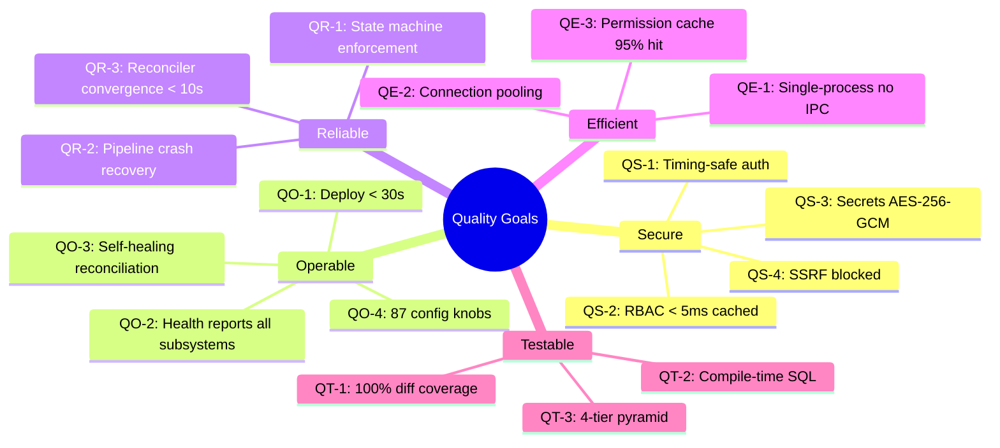

# 10. Quality Requirements

## Quality Tree

## Quality Scenarios

### Security

| ID | Scenario | Expected Response | Priority |
|---|---|---|---|
| QS-1 | Attacker attempts user enumeration via login timing | Response time is constant regardless of whether user exists (dummy hash for missing users) | High |
| QS-2 | Authenticated user requests permission check | Cached resolution returns within 5ms; cache miss resolves from DB within 50ms | High |
| QS-3 | Database is compromised | Secret values are encrypted at rest with AES-256-GCM; attacker cannot read plaintext without `PLATFORM_MASTER_KEY` | Critical |
| QS-4 | User supplies webhook URL pointing to internal network | `validate_webhook_url()` blocks private IPs, link-local, loopback, and cloud metadata endpoints | High |
| QS-5 | Agent session created | Ephemeral identity has only delegated permissions, scoped to project, time-bounded | High |
| QS-6 | API token with scoped permissions | Token can only use permissions listed in its `scopes` field; boundary restricts visible resources | Medium |

### Operability

| ID | Scenario | Expected Response | Priority |
|---|---|---|---|
| QO-1 | Operator deploys new version | Single binary, single container image; K8s rolling update completes in < 30s | High |
| QO-2 | Operator checks system health | `GET /healthz` returns component status for Postgres, Valkey, MinIO, K8s, pipeline executor, deployer reconciler | High |
| QO-3 | Platform pod crashes during pipeline execution | After restart, reconciler and executor resume from DB state; pending pipelines re-execute | High |
| QO-4 | Operator needs to tune behavior | 87 environment variables cover all configurable aspects (12-factor) | Medium |
| QO-5 | First deployment in new environment | Setup token generated on first boot; admin created via token-based setup flow | Medium |

### Reliability

| ID | Scenario | Expected Response | Priority |
|---|---|---|---|
| QR-1 | Code attempts invalid state transition | `can_transition_to()` returns false; transition rejected with error | High |
| QR-2 | Pipeline executor pod restarts mid-execution | On restart, executor polls for `running` pipelines and resumes monitoring | High |
| QR-3 | Ops repo updated with new deployment | Reconciler detects change within 10s (poll) or immediately (Notify), applies manifests | Medium |
| QR-4 | Canary deployment shows elevated error rate | Analysis loop detects within 15s, triggers automatic rollback | Medium |

### Efficiency

| ID | Scenario | Expected Response | Priority |
|---|---|---|---|
| QE-1 | High concurrent API requests | Single process handles all requests; no network hops between modules | Medium |
| QE-2 | 100 concurrent database queries | Connection pool (PgPool) manages connections; no connection exhaustion | Medium |
| QE-3 | Repeated permission checks for same user/project | Valkey cache serves ~95% of requests; DB load reduced proportionally | Medium |

### Testability

| ID | Scenario | Expected Response | Priority |
|---|---|---|---|
| QT-1 | Developer changes code and submits PR | `just cov-diff-check` verifies 100% coverage on changed lines | High |
| QT-2 | Developer writes SQL query | `sqlx::query!` macro validates query against real DB schema at compile time | High |
| QT-3 | Developer runs full test suite | 4-tier pyramid (unit → integration → E2E → LLM) with real infrastructure per tier | High |
| QT-4 | Tests run in parallel | `#[sqlx::test]` provides per-test DB isolation; UUID-scoped Valkey keys prevent collision | Medium |
